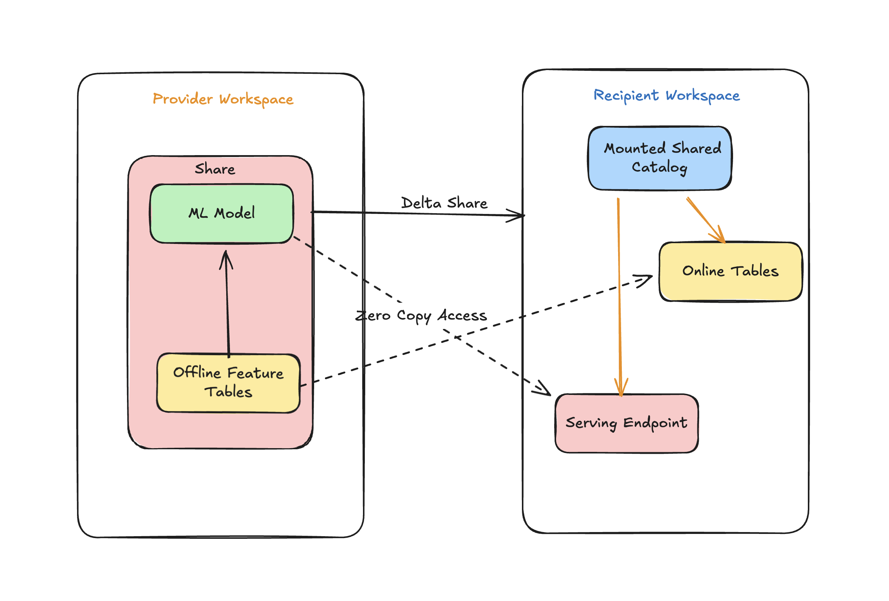

# Cross-Region Model Serving with Delta Sharing

Share ML models across Databricks workspaces using Delta Sharing, with automatic online feature table synchronization and serving endpoint deployment.

## What This Does

This tool automates sharing an ML model from one Databricks workspace to another:



**How it works:**
1. **Provider Workspace**: Your ML model and its feature tables are packaged into a Delta Share
2. **Delta Sharing**: Securely transfers the share to the recipient workspace (zero-copy for same cloud)
3. **Recipient Workspace**:
   - Mounts the shared catalog (read-only access to model and tables)
   - Creates online tables from shared feature tables for low-latency lookup
   - Deploys a serving endpoint that automatically looks up features at inference time

## Key Concepts (for Beginners)

**Databricks Workspace**: A cloud environment where you build and run data/ML workloads.

**Unity Catalog**: The central place where all your data assets (tables, models) are registered.

**Delta Sharing**: A technology to securely share data between workspaces (even across organizations).

**Feature Table**: A table containing features (input variables) for ML models.

**Online Table**: A fast-access copy of your feature table for real-time inference.

**Serving Endpoint**: An API that serves your model for predictions.

## Prerequisites

Before you start, you need:

1. **Databricks CLI** (version 0.218.0 or later) — the **new** Databricks CLI, not the legacy `databricks-cli` PyPI package

   **macOS / Linux (Homebrew):**
   ```bash
   brew tap databricks/tap
   brew install databricks
   ```

   **macOS / Linux (curl):**
   ```bash
   curl -fsSL https://raw.githubusercontent.com/databricks/setup-cli/main/install.sh | sh
   ```

   **Windows (WinGet):**
   ```powershell
   winget install Databricks.DatabricksCLI
   ```

   ```bash
   # Verify version (must be 0.218.0+)
   databricks --version
   ```

   > **Note:** Do *not* use `pip install databricks-cli` — that installs the legacy CLI which does not support Databricks Asset Bundles.

2. **Python 3.8+** installed

3. **Two Databricks Workspaces** (can be the same workspace for testing)

4. **Required Permissions**:
   - Source workspace: Can create shares and recipients
   - Target workspace: Can create catalogs, online stores, and serving endpoints

## Quick Start

### Step 1: Clone the Repository

```bash
git clone https://github.com/debu-sinha/cross-region-model-serving-dab.git
cd cross-region-model-serving-dab
```

### Step 2: Configure Databricks CLI Authentication

You have two options for authentication. Choose ONE:

**Option A: Using a CLI Profile (Recommended)**

```bash
# Create a profile for your workspace
databricks configure --profile my-workspace

# When prompted, enter:
#   - Databricks Host: https://your-workspace.cloud.databricks.com
#   - Personal Access Token: your-token

# Then set the profile for this session
export DATABRICKS_CONFIG_PROFILE=my-workspace
```

**Option B: Using Environment Variables**

```bash
export DATABRICKS_HOST="https://your-workspace.cloud.databricks.com"
export DATABRICKS_TOKEN="your-personal-access-token"
```

**Verify authentication works:**

```bash
databricks auth describe
```

You should see your workspace URL and user email.

### Step 3: Create a Secret Scope for Target Workspace Credentials

The job needs credentials to connect to the target workspace. Store these in a secret scope:

```bash
# Create a secret scope (choose a name, default is 'my_cross_region_secrets')
databricks secrets create-scope my_cross_region_secrets

# Store target workspace URL
databricks secrets put-secret my_cross_region_secrets host \
  --string-value "https://target-workspace.cloud.databricks.com"

# Store target workspace personal access token
databricks secrets put-secret my_cross_region_secrets token \
  --string-value "YOUR_TARGET_WORKSPACE_TOKEN"
```

**How to get a token**: In your target workspace, go to **User Settings > Developer > Access Tokens > Generate New Token**.

**Note**: If source and target are the same workspace, use the same workspace URL and token.

### Step 4: Review Configuration (Optional)

The defaults in `databricks.yml` work for most cases. Review and modify if needed:

```yaml
variables:
  secret_scope:
    default: my_cross_region_secrets  # Must match Step 3

  # For same-metastore sharing (most common):
  provider_name:
    default: self
```

### Step 5: Deploy the Bundle

```bash
databricks bundle deploy -t dev
```

This uploads the code and creates the job in your workspace.

### Step 6: Run the Job

```bash
databricks bundle run -t dev cross_region_model_share_job
```

The job will:
1. Create a demo model with feature table (for testing)
2. Set up Delta Sharing from source to target
3. Create online tables in the target for low-latency feature lookup
4. Deploy a serving endpoint

**Monitor progress**: The command outputs a URL to track the job run.

## Configuration Reference

All settings are in `databricks.yml`. Here's what each one does:

### Secret Scope Configuration

| Parameter | What It Does | Default Value |
|-----------|--------------|---------------|
| `secret_scope` | Name of the Databricks secret scope containing target workspace credentials | `my_cross_region_secrets` |

**Your secret scope must contain two secrets:**
- `host`: Target workspace URL (e.g., `https://target.cloud.databricks.com`)
- `token`: Target workspace personal access token

### Source Workspace Settings

| Parameter | What It Does | Default Value |
|-----------|--------------|---------------|
| `model_name` | Full name of the model to share (format: `catalog.schema.model`) | `main.default.model_<your_username>` |
| `share_name` | Name for the Delta Share | `share_<your_username>` |
| `recipient_name` | Name for the recipient (ignored for same-metastore) | `recipient_<your_username>` |
| `create_recipient` | Whether to create recipient if it doesn't exist | `true` |

### Target Workspace Settings

| Parameter | What It Does | Default Value |
|-----------|--------------|---------------|
| `provider_name` | Provider name. Use `self` if both workspaces share the same Unity Catalog metastore | `self` |
| `target_catalog` | Name for the catalog created from the share | `shared_catalog_<your_username>` |
| `use_existing_catalog` | Use an existing catalog instead of creating one | `false` |

### Serving Endpoint Settings

| Parameter | What It Does | Default Value |
|-----------|--------------|---------------|
| `deploy_serving` | Whether to deploy a serving endpoint | `true` |
| `serving_endpoint_name` | Name for the serving endpoint | `target-model-<your_username>-endpoint` |

### Online Feature Store Settings

These are required if your model uses feature lookups (features are automatically retrieved at inference time).

| Parameter | What It Does | Default Value |
|-----------|--------------|---------------|
| `create_online_table` | Whether to create online tables for fast feature lookup | `true` |
| `online_store_name` | Name for the Lakebase online store | Auto-generated |
| `create_online_store` | Create the online store if it doesn't exist | `true` |
| `online_table_target_catalog` | Writable catalog for online tables (IMPORTANT: shared catalogs are read-only) | `main` |
| `online_table_target_schema` | Schema for online tables | `default` |

## Common Use Cases

### Use Case 1: Share Your Production Model

Edit `databricks.yml`:

```yaml
variables:
  model_name:
    default: "prod_catalog.ml_models.fraud_detector"
  create_online_table:
    default: "true"
```

### Use Case 2: No Feature Lookups

If your model doesn't use feature tables:

```yaml
variables:
  create_online_table:
    default: "false"
```

### Use Case 3: Same Workspace Testing

For testing with source and target in the same workspace:

```yaml
variables:
  provider_name:
    default: "self"  # Uses built-in same-metastore sharing
```

### Use Case 4: User Without CREATE CATALOG Permission

Ask your admin to create the shared catalog first, then:

```yaml
variables:
  use_existing_catalog:
    default: "true"
  target_catalog:
    default: "admin_created_catalog"
```

## Job Tasks Explained

The job runs three tasks in sequence:

### Task 1: demo_setup

Creates a sample model with feature table for testing. **Skip this if you're sharing your own model** by removing it from the job definition.

### Task 2: source_share_setup

Runs in the source workspace:
- Detects feature table dependencies from your model
- Creates a Delta Share
- Adds model and feature tables to the share
- Creates or configures the recipient

### Task 3: target_registration_setup

Runs with target workspace credentials:
- Creates a shared catalog from the Delta Share
- Creates online tables (for fast feature lookup)
- Waits for online tables to be ready
- Deploys the model to a serving endpoint

## Troubleshooting

### "Permission denied" errors

**Problem**: You don't have required permissions.

**Solution**:
- Source: Need `CREATE SHARE` and `CREATE RECIPIENT` permissions
- Target: Need `CREATE CATALOG`, `CREATE ONLINE STORE`, `CREATE SERVING ENDPOINT`

### "Secret not found" error

**Problem**: The secret scope or secrets don't exist.

**Solution**: Create them using the commands in Step 3 above.

### "Online table not ready" errors

**Problem**: Trying to deploy endpoint before online tables are ready.

**Solution**: The code automatically waits, but if it times out:
1. Check that `online_table_target_catalog` is writable (not the shared catalog)
2. Verify your source table has Change Data Feed enabled

### "Same sharing identifier" error

**Problem**: Trying to create a D2D recipient when both workspaces share the same metastore.

**Solution**: Set `provider_name: "self"` in your configuration.

### Bundle validation fails with host mismatch

**Problem**: Error about host in profile not matching bundle configuration.

**Solution**: This bundle uses your CLI profile or environment variables for the workspace host. Do NOT set `host: ${DATABRICKS_HOST}` in the targets section of `databricks.yml`. The workspace is automatically determined from your authentication.

## MCP Server

The project includes an MCP (Model Context Protocol) server that exposes the sharing and consumption workflows as tools for AI assistants like Claude Desktop, Cursor, and VS Code.

### Install

```bash
pip install -e .
```

### MCP Client Configuration

**Claude Desktop** - add to `claude_desktop_config.json`:

```json
{
  "mcpServers": {
    "cross-region-model-serving": {
      "command": "cross-region-mcp",
      "env": {
        "DATABRICKS_HOST": "https://your-workspace.cloud.databricks.com",
        "DATABRICKS_TOKEN": "dapi..."
      }
    }
  }
}
```

**Cursor** - add to `.cursor/mcp.json`:

```json
{
  "mcpServers": {
    "cross-region-model-serving": {
      "command": "cross-region-mcp",
      "env": {
        "DATABRICKS_HOST": "https://your-workspace.cloud.databricks.com",
        "DATABRICKS_TOKEN": "dapi..."
      }
    }
  }
}
```

Or run directly without installing:

```json
{
  "mcpServers": {
    "cross-region-model-serving": {
      "command": "python",
      "args": ["src/mcp_server.py"],
      "cwd": "/path/to/cross-region-model-serving-dab",
      "env": {
        "DATABRICKS_HOST": "https://your-workspace.cloud.databricks.com",
        "DATABRICKS_TOKEN": "dapi..."
      }
    }
  }
}
```

### Available Tools

| Tool | What it does |
|------|-------------|
| `share_model` | Set up Delta Sharing for a model and its feature table dependencies |
| `consume_shared_model` | Consume a shared model on a target workspace (catalog, online tables, endpoint) |
| `inspect_model_dependencies` | Check what feature tables a model depends on |
| `list_shares` | List all Delta Shares in a workspace |
| `list_recipients` | List all sharing recipients in a workspace |
| `get_share_details` | Get a share's objects and permissions |
| `check_endpoint_status` | Check a serving endpoint's readiness state |
| `validate_target_configuration` | Pre-validate target config before running consumption |

### Working with Multiple Workspaces

The `DATABRICKS_HOST`/`DATABRICKS_TOKEN` env vars set the default workspace. Every tool also accepts optional credentials to connect to a different workspace instead:

- **Source-side tools** (`share_model`, `list_shares`, `list_recipients`, `get_share_details`, `inspect_model_dependencies`) accept `workspace_host` and `workspace_token` (or `source_host`/`source_token` for `share_model`).
- **Target-side tools** (`consume_shared_model`, `check_endpoint_status`) require explicit `target_host` and `target_token` since they always operate on a remote workspace.

This means you can set your source workspace in the env vars and pass target workspace credentials per-call, or skip env vars entirely and provide credentials explicitly to every tool.

### Usage Examples

Once configured, ask your AI assistant:

- *"List all Delta Shares in my workspace"*
- *"Share my model main.ml.fraud_detector to a recipient called analytics-team"*
- *"Check if the serving endpoint target-fraud-endpoint is ready on https://target.cloud.databricks.com"*
- *"What feature tables does main.ml.fraud_detector depend on?"*
- *"List the recipients on my target workspace at https://target.cloud.databricks.com"*

## Project Structure

```
cross-region-model-serving/
├── databricks.yml              # Main configuration file
├── resources/
│   └── model_share_job.yml     # Job definition
├── src/
│   ├── main.py                 # CLI entry point
│   ├── mcp_server.py           # MCP server (8 tools, stdio transport)
│   ├── source_manager.py       # Source workspace logic
│   ├── target_manager.py       # Target workspace logic
│   ├── demo_setup.py           # Demo model creation
│   └── utils.py                # Shared utilities
├── tests/
│   ├── test_managers.py        # Source/Target manager tests
│   └── test_mcp_server.py      # MCP server tests (14 tests)
├── setup.py                    # Python package setup
└── README.md                   # This file
```

## Known Limitations

These are product-level limitations in Databricks, not limitations of this DAB:

- **Online tables require writable catalog**: Online tables cannot be created in shared (read-only) catalogs. This DAB creates them in a separate writable catalog (`online_table_target_catalog`).

- **Snapshot sync only for shared tables**: Delta Shared feature tables can only use Snapshot sync mode for synced tables (Lakebase). Triggered and Continuous modes are not available for shared tables, meaning changes to offline feature tables are not immediately available at the target.

- **Multiple shares of same model**: If the same model is shared via multiple Delta Shares to the same recipient workspace, only the most recently created share is recognized. Avoid sharing the same model through multiple shares to the same recipient.

## Cost Considerations

- **Lakebase Online Stores**: Billed based on capacity. Delete when not in use.
- **Serving Endpoints**: Billed while running. Can scale to zero if configured.
- **Delta Sharing**: No additional cost for sharing within the same cloud.

## Production Notes

### Unity Catalog Prerequisites

- Both workspaces must have Unity Catalog enabled
- Source workspace metastore must have Delta Sharing enabled (Workspace Settings > Delta Sharing)
- For cross-metastore sharing, both metastores must be accessible

### RBAC Requirements

| Role | Source Workspace | Target Workspace |
|------|-----------------|-----------------|
| **Minimum** | `CREATE SHARE`, `CREATE RECIPIENT` on metastore | `USE CATALOG`, `USE SCHEMA`, `SELECT` on shared catalog |
| **Full deployment** | Above + model read access | Above + `CREATE CATALOG`, `CREATE SERVING ENDPOINT`, online store admin |
| **Without CREATE CATALOG** | — | Set `use_existing_catalog: true` and have admin pre-create the catalog |

### Online Table Prerequisites

- Source feature tables must have **Change Data Feed** enabled (`ALTER TABLE SET TBLPROPERTIES (delta.enableChangeDataFeed = true)`)
- Primary key columns must have `NOT NULL` constraints
- Target workspace must support Lakebase (online store)

### Resource Teardown

To avoid ongoing costs, tear down resources in this order:

```bash
# 1. Delete the serving endpoint
databricks serving-endpoints delete <endpoint-name>

# 2. Delete online tables (via Catalog Explorer UI or API)
#    Navigate to: Catalog > <online_table_target_catalog> > <schema> > online tables

# 3. Delete the online store
#    Navigate to: Catalog Explorer > Online Stores > delete

# 4. Remove the shared catalog (target workspace)
databricks catalogs delete <target_catalog> --force

# 5. Remove the share and recipient (source workspace)
databricks shares delete <share_name>
databricks recipients delete <recipient_name>
```

> **Important:** Delete the serving endpoint *first*. Deleting online tables while an endpoint references them will cause serving errors.

## How to Cite

If you use this project in your work, see [`CITATION.cff`](CITATION.cff) or cite as:

> Sinha, D. (2025). *Cross-Region Model Serving with Delta Sharing*. GitHub. https://github.com/debu-sinha/cross-region-model-serving-dab

## Author

**Debu Sinha** - [GitHub](https://github.com/debu-sinha)

## License

This project is licensed under the MIT License — see the [LICENSE](LICENSE) file for details.
