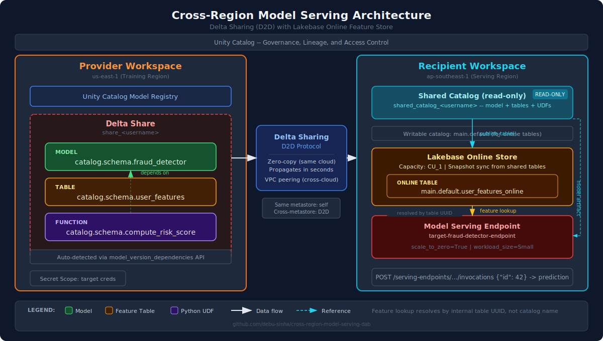
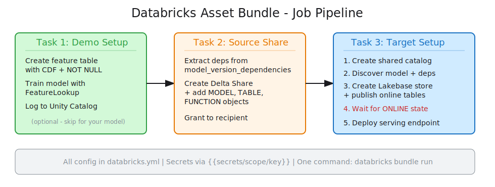

# Automating Cross-Region Model Serving on Databricks with Delta Sharing

*By Debu Sinha, Lead Applied AI/ML at Databricks*

Every enterprise I work with eventually asks the same question: "We trained this model in us-east-1, but our APAC customers need predictions served from ap-southeast-1. How do we do that without rebuilding everything?"

The short answer is Delta Sharing. The longer answer is that Delta Sharing alone is not enough -- you still need to handle dependency discovery, online table provisioning, endpoint ordering, and a dozen other details that trip teams up in production. I built an open-source Databricks Asset Bundle that automates all of it, and I want to share the pattern because I think it solves a problem that most ML platform teams are still solving by hand.

## Why This Matters for Production ML Teams

Cross-region model serving is not a niche requirement. It comes up in three scenarios that show up repeatedly in enterprise ML deployments:

**Latency** - A recommendation model trained on centralized data needs to serve predictions within 10ms in every region where the product operates. You cannot route inference traffic across continents and meet that SLA.

**Data residency** - Regulatory requirements (GDPR, CCPA, industry-specific rules) dictate where model predictions can be generated. The training data might live in one jurisdiction, but the serving endpoint needs to run in another.

**Disaster recovery** - A single-region serving deployment is a single point of failure. Multi-region serving gives you a hot standby that can absorb traffic if the primary region goes down.

In all three cases, the challenge is the same: a Unity Catalog model is not a standalone artifact. It carries dependencies -- feature tables for real-time lookup, Python UDFs for on-demand feature computation, and connections to online stores. Moving the model to another workspace means moving (or recreating) all of those dependencies in the right order, and getting any step wrong results in an endpoint that fails to start or returns errors at inference time.

I have seen teams spend days doing this manually for a single model. Then they do it again next quarter when the model is retrained with new features. It does not scale.

## The Pattern I Built

I built a Databricks Asset Bundle (DAB) that automates the full cross-region model serving pipeline. It is open source at [github.com/debu-sinha/cross-region-model-serving-dab](https://github.com/debu-sinha/cross-region-model-serving-dab), and it handles every step from dependency discovery through endpoint deployment with a single command.



The architecture has two sides: a **provider workspace** where the model was trained, and a **recipient workspace** where the model needs to serve predictions. Delta Sharing bridges them using Databricks-to-Databricks (D2D) sharing, which is zero-copy within the same cloud and propagates model versions to the recipient within seconds.

The key automation gap I set out to solve: **Delta Sharing does not automatically include a model's dependencies.** When you add a model to a share, its feature tables and Python UDFs are NOT included. You have to inspect the model's `model_version_dependencies` metadata and add each dependency to the share explicitly. This is exactly the kind of tedious, error-prone work that should be automated.

### What the Automation Handles

| Dependency Type | Auto-Detected | Auto-Shared | Notes |
|---|---|---|---|
| Feature tables (offline) | Yes | Yes | Added to the Delta Share as TABLE objects |
| Python UDFs (on-demand features) | Yes | Yes | Added as FUNCTION objects (D2D sharing only) |
| Online tables (Lakebase) | N/A | Recreated | Cannot be shared -- created fresh on target from shared offline tables |
| Connections/credentials | Detected | No | Must be manually provisioned on target |

The Python UDF support is worth highlighting. FeatureFunctions -- on-demand features computed by registered Python UDFs at inference time -- are a newer capability in Databricks Feature Engineering. Most teams I talk to are not aware that these need to be explicitly added to a Delta Share as FUNCTION objects. The automation handles it.

## How It Works: A Three-Task Pipeline

The bundle runs a three-task Databricks job. The task ordering is deliberate and enforced -- getting this sequence wrong is the most common failure mode I see in manual deployments.



**Task 1: Demo Setup** (optional) - Creates a sample model with feature table and FeatureLookup integration. This lets you validate the entire pipeline end-to-end without bringing your own model. Remove this task when deploying against your production models.

**Task 2: Source Share Setup** - This is where the dependency discovery happens. The SourceManager reads the model's `model_version_dependencies` from Unity Catalog, collects every table and function the model depends on, creates a Delta Share, adds all objects, and grants the recipient SELECT access.

It also handles a common edge case: if the source and target workspaces share the same Unity Catalog metastore (typical for dev/staging/prod within one organization), it automatically uses the built-in `self` recipient instead of trying to create a D2D recipient, which would fail with a "same sharing identifier" error.

**Task 3: Target Registration** - This is the most involved step, and the ordering within it matters:

1. Create a shared catalog from the Delta Share
2. Discover the model and extract its dependencies from the shared catalog
3. Provision a Lakebase online store and publish feature tables as online tables
4. **Wait until every online table reaches ONLINE state** (critical -- deploy before this and the endpoint fails)
5. Deploy the serving endpoint

The wait step is non-negotiable. If you deploy a serving endpoint before online tables are ready, it fails with "Online feature store setup failed." The error message does not tell you it is an ordering problem, which makes it frustrating to debug manually. The automation handles the polling (30-second intervals, 10-minute timeout) and will not proceed to endpoint deployment until all tables report ONLINE.

### A Discovery That Simplifies Everything

When I first built this, I assumed that feature lookups would break after sharing because the catalog names change. A model trained against `prod_catalog.ml.transactions` sees its feature table as `shared_catalog.ml.transactions` in the target -- different catalog prefix, same schema and table name.

After testing, I found that Unity Catalog resolves feature lookups using internal table IDs (UUIDs), not catalog name strings. When `publish_table()` creates an online table from a shared feature table, the `source_table_id` is set correctly, and the serving endpoint matches features by ID, not by name. The model works in the target workspace without re-logging or any path remapping.

This is a critical detail for the automation -- it means the pipeline does not need a "fix up feature references" step. The model artifact is portable as-is.

## Enterprise Deployment Configuration

Everything is parameterized through `databricks.yml`. An enterprise platform team can fork this bundle, set their organization-specific defaults, and hand it to ML engineers as a self-service deployment tool.

```yaml
variables:
  secret_scope:
    default: my_cross_region_secrets    # Secret scope with target credentials
  model_name:
    default: main.default.model_${workspace.current_user.short_name}
  provider_name:
    default: self                       # 'self' for same-metastore sharing
  create_online_table:
    default: "true"                     # Set false if model has no feature lookups
  online_table_target_catalog:
    default: main                       # Writable catalog for online tables
```

Target workspace credentials are stored in a Databricks secret scope and resolved at runtime. The code detects `{{secrets/scope/key}}` references and calls `dbutils.secrets.get()` on the cluster, so credentials never appear in job parameters or logs.

For enterprises with strict RBAC, the bundle supports a `use_existing_catalog: true` mode where an admin pre-creates the shared catalog and ML engineers deploy endpoints into it without needing CREATE CATALOG permissions.

### Production Quick Start

```bash
git clone https://github.com/debu-sinha/cross-region-model-serving-dab.git
cd cross-region-model-serving-dab

# Store target workspace credentials in a secret scope
databricks secrets create-scope my_cross_region_secrets
databricks secrets put-secret my_cross_region_secrets host \
  --string-value "https://target-workspace.cloud.databricks.com"
databricks secrets put-secret my_cross_region_secrets token \
  --string-value "YOUR_TARGET_WORKSPACE_TOKEN"

# Deploy and run -- one command
databricks bundle deploy -t dev
databricks bundle run -t dev cross_region_model_share_job
```

## Operational Tradeoffs

Every architecture pattern has constraints. Here are the ones that matter for production planning:

**Snapshot-only sync for shared tables.** Online tables created from Delta Shared feature tables only support Snapshot sync mode. Triggered and Continuous modes are not available. This means feature data in the target region is only as fresh as the last snapshot. For most serving use cases (features that change daily or less frequently), this is fine. For features that change every few minutes, you will need to run the source feature pipeline in the target region instead of sharing.

**Shared catalogs are read-only.** You cannot create online tables inside a shared catalog. Online tables must go in a separate writable catalog in the target workspace. The `online_table_target_catalog` parameter handles this, but it is the most common point of confusion during initial setup.

**Table ID stability matters.** Feature lookup resolution is table-ID-based. If someone drops and recreates a source feature table (even with the same name and schema), the UUID changes and the online table link breaks. Remediation paths: `UNDROP TABLE WITH ID` to restore the original, or re-publish and re-deploy.

**D2D sharing required for models.** ML models, Python UDFs, and FeatureSpecs can only be shared through Databricks-to-Databricks sharing. Open sharing (token-based, for non-Databricks recipients) only supports tabular data. Both workspaces must have Unity Catalog enabled.

**Cost awareness.** Lakebase online stores are billed by capacity. Serving endpoints are billed while running (scale-to-zero reduces but does not eliminate cost). Delta Sharing within the same cloud has no extra charge. Tear down resources in order: endpoint first, then online tables, then online store, then catalog.

### Schema-Level Sharing for Mature Pipelines

For production ML pipelines that evolve over time, consider sharing at the schema level instead of individual objects. When you share an entire schema, new models, tables, and volumes added to that schema are automatically visible to recipients. The bundle currently shares individual objects for maximum control, but schema-level sharing is the recommended approach when you want a "share everything in this ML namespace" pattern that does not require re-running the pipeline every time a feature table is added.

## Extending the Pattern: An MCP Server for AI-Assisted Operations

Beyond the batch automation, I also built an MCP (Model Context Protocol) server that exposes the sharing and consumption workflows as tools for AI coding assistants. The idea is that the DAB handles scheduled, automated deployments, while the MCP server enables ad-hoc, conversational operations -- inspecting model dependencies, checking endpoint status, or setting up a share interactively through natural language.

The MCP server exposes eight tools:

| Tool | What it does |
|------|-------------|
| `share_model` | Set up Delta Sharing for a model and its dependencies |
| `consume_shared_model` | Run the full target pipeline (catalog, online tables, endpoint) |
| `inspect_model_dependencies` | Check what feature tables and functions a model depends on |
| `list_shares` / `list_recipients` | Read-only workspace inspection |
| `get_share_details` | Get a share's objects and permissions |
| `check_endpoint_status` | Check if a serving endpoint is ready |
| `validate_target_configuration` | Pre-validate config before running a deployment |

An engineer can connect this to Claude Desktop, Cursor, or VS Code and ask things like "What feature tables does my fraud model depend on?" or "Check if the APAC endpoint is ready." Every tool supports explicit workspace credentials, so you can operate across multiple workspaces from a single MCP client.

This pairs well with another MCP server I built, [excalidraw-mcp-server](https://github.com/debu-sinha/excalidraw-mcp-server), which gives AI assistants tools for creating Excalidraw diagrams. The architecture diagrams in this article were generated that way -- the AI reads the code, understands the system architecture, and produces visual artifacts through MCP tools. No manual diagramming.

## Who Should Use This

This pattern is directly applicable to any enterprise running ML models on Databricks that needs to serve predictions in more than one region. Specifically:

- **ML platform teams** building self-service model deployment infrastructure. Fork the bundle, set your org defaults, and give it to ML engineers as a deployment tool.
- **MLOps engineers** who are currently doing cross-region model deployment manually. This eliminates the manual steps and makes the process repeatable.
- **Teams adopting Lakebase** (Databricks' new online table infrastructure) who need feature serving across regions. The bundle handles the online store provisioning and the critical ordering requirements.
- **Organizations with data residency requirements** who need models trained in one jurisdiction to serve predictions in another while maintaining governance through Unity Catalog.

The bundle is designed to be a starting point. Fork it, adapt the configuration for your environment, add it to your CI/CD pipeline, and extend it as your needs evolve.

## What's Next

There are a few areas I am actively working on:

- **FeatureSpec sharing** -- FeatureSpecs define the full feature retrieval pipeline (lookups + on-demand functions) but are not yet automated in the sharing pipeline
- **Continuous sync for shared tables** -- The current snapshot-only limitation means feature freshness depends on sync frequency. Triggered/continuous sync for shared tables would close this gap.
- **Multi-model consolidated shares** -- Sharing multiple related models through a single Delta Share with deduplicated dependency management

The repo is at [github.com/debu-sinha/cross-region-model-serving-dab](https://github.com/debu-sinha/cross-region-model-serving-dab). Try it, file issues, send PRs. The whole point of open-sourcing this is so teams do not have to solve this problem from scratch.

---

*Debu Sinha is a Lead Specialist Solutions Architect for AI/ML at Databricks. He works with enterprise ML teams on production model serving, MLOps, and evaluation infrastructure. He is the author of [Practical Machine Learning on Databricks](https://www.packtpub.com/product/practical-machine-learning-on-databricks/9781801812030) (Packt, 2023) and an IEEE Senior Member.*
